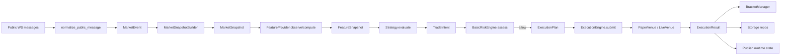
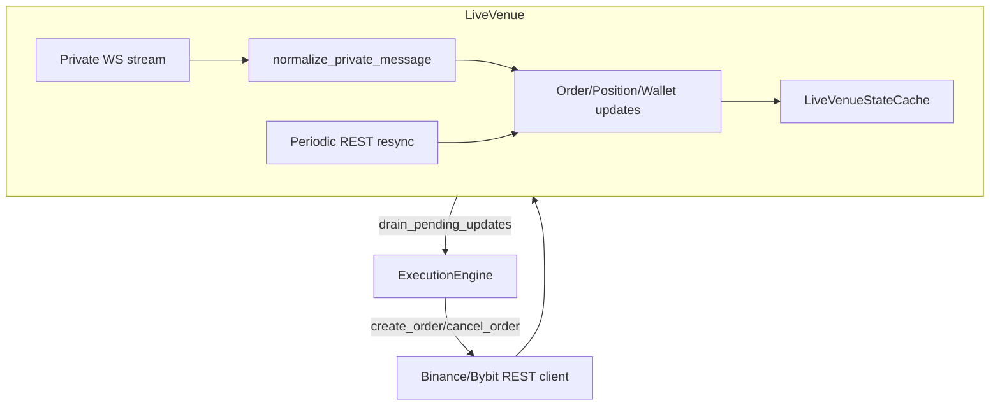
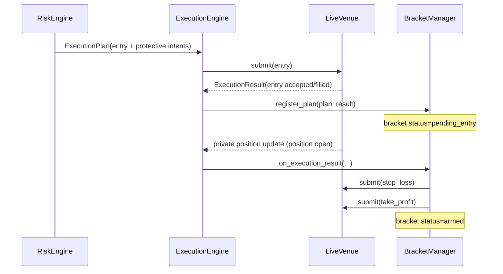

# Карта кодовой базы (trading_bot)

Документ для быстрого понимания: где что лежит, кто за что отвечает, и как данные текут через систему.

Дата среза: 2026-03-08.

Примечания:
- Ниже перечислен **исходный код и важные артефакты**, без `__pycache__/` и `*.pyc` (это генерируется Python и не является “нашим” кодом).
- Большинство ключевых типов данных описаны в `src/trading_bot/domain/models.py`, а “проводка” зависимостей делается в `src/trading_bot/bootstrap/container.py`.

Быстрая “карта” (упрощенное дерево):

```text
trading_bot/
  alembic/                # миграции БД
  config/                 # YAML конфиги
  docs/runbooks/          # ранбуки
  src/trading_bot/        # основной пакет
    adapters/exchanges/   # биржи (REST/WS/normalizers)
    marketdata/           # market/private events, feed, snapshots, capture
    features/             # FeatureProvider
    strategies/           # торговые стратегии
    risk/                 # RiskEngine -> ExecutionPlan
    execution/            # ExecutionEngine + BracketManager
    live/                 # LiveVenue + recovery/state
    paper/                # PaperVenue + fill model
    runtime/              # runtime loop/control/reconciliation
    storage/              # Postgres/Redis/Parquet repos
    alerts/               # Telegram ops
    llm/                  # advisory слой
    observability/        # logging/metrics/health
  tests/                  # unit/integration/smoke
```

## 1) Репозиторий (корень)

`alembic/`
- `alembic/env.py` — настройка Alembic.
- `alembic/versions/0001_foundation_schema.py` — базовая схема.
- `alembic/versions/0002_phase2_bybit_storage.py` — расширение под phase-2 storage.
- `alembic/versions/0003_phase3_paper_replay_runtime.py` — расширение под paper/replay/backtest.

`config/` — YAML-конфиги (поверх `config/base.yaml` + overrides):
- `config/base.yaml` — база.
- `config/dev.yaml` — дев-режим (локальные настройки).
- `config/prod.yaml` — прод-режим (общие настройки).
- `config/live_testnet.yaml` — лайв на testnet (общий).
- `config/live_binance_testnet.yaml` — лайв на Binance Futures testnet.
- `config/live_prod_micro.yaml` — лайв micro-роллаут (Bybit/Binance в зависимости от primary).
- `config/live_binance_prod_micro_fast.yaml` — “быстрый” micro-конфиг для Binance (использовали для smoke-тестов на mainnet).

`docs/runbooks/` — ранбуки эксплуатации:
- `docs/runbooks/live_testnet_smoke.md` — тестнет смоук.
- `docs/runbooks/live_mainnet_micro.md` — mainnet micro-роллаут.
- `docs/runbooks/live_restart_recovery.md` — рестарт/рекавери.
- `docs/runbooks/paper_soak.md` — paper soak.
- `docs/runbooks/llm_advisory.md` — LLM advisory слой.

`src/` — исходники Python пакета (layout “src/”).

`tests/`
- `tests/unit/` — unit-тесты модулей.
- `tests/integration/` — интеграционные (если есть).
- `tests/smoke/` — смоук-сценарии (если есть).

Ключевые файлы корня:
- `pyproject.toml` — зависимости, `bot` CLI entrypoint (`[project.scripts]`).
- `.env.example` — пример переменных окружения (`TB_*`).
- `docker-compose.yml`, `Dockerfile` — локальный стек (app + postgres + redis).
- `README.md` — основной англоязычный обзор и команды.
- `readme_rus.md` — русскоязычный обзор (если открывать через инструменты, учитывай кодировку).

## 2) Entrypoints (как это запускается)

`src/trading_bot/cli.py`
- Typer CLI: `validate-config`, `doctor`, `serve`, `run`, `live-preflight`, `soak-paper`, `capture`, `replay`, `backtest`, `db upgrade/current`.
- Ключевая точка входа для локального запуска: `uv run bot ...` (см. `pyproject.toml`).

`src/trading_bot/app.py`
- FastAPI shell: `/health`, `/ready`, `/metrics`.

`src/trading_bot/main.py`
- Мини-обертка, которая зовет CLI `main()`.

`src/trading_bot/timeframes.py`
- Утилиты таймфреймов: `canonicalize_interval(...)`, конвертация в минуты и маппинг (используется в конфиге/фичах/WS топиках).

`src/trading_bot/bootstrap/container.py`
- Сборка зависимостей: Redis/Postgres, REST/WS клиенты бирж, market feed, runtime runner, capture service, Telegram/LLM (если включены).

`src/trading_bot/bootstrap/settings.py`
- Pydantic settings `BootstrapSettings` из `.env` (`TB_ENV`, `TB_CONFIG_FILE`, DSN’ы и ключи бирж).

## 3) Доменные типы и контракты (ядро)

`src/trading_bot/domain/enums.py`
- Enum’ы: `RunMode`, `ExchangeName`, `MarketType`, `ExecutionVenueKind`, `TradeAction` и т.д.

`src/trading_bot/domain/models.py`
- Pydantic-модели: `MarketSnapshot`, `FeatureSnapshot`, `TradeIntent`, `ExecutionPlan`, `OrderState`, `PositionState`, `AccountState`, `ExecutionResult`, `KillSwitchState` и т.д.
- Это “общий язык” между marketdata/features/strategy/risk/execution/storage.

`src/trading_bot/domain/protocols.py`
- Протоколы (интерфейсы) для стратегии/венью/и т.п. (контрактный слой).

## 4) Конфигурация

`src/trading_bot/config/schema.py`
- Pydantic-схема всего конфига (`AppSettings` + вложенные секции `exchange/live/market_data/risk/strategy/...`).

`src/trading_bot/config/loader.py`
- Загрузка YAML + env overrides, нормализация legacy полей, валидация, fingerprint.
- Live-валидации: например `exchange.private_state_enabled` и `live.symbol_allowlist`.

## 5) Адаптеры бирж (REST/WS + нормализация)

Общий принцип:
- `public_ws.py` получает биржевые публичные сообщения
- `private_ws.py` получает приватные события (аккаунт/ордера/позиции) через listenKey и т.д.
- `rest.py` для REST запросов
- `normalizers.py` переводит сырые payload’ы биржи в наши события/модели из `domain/models.py`
- `capabilities.py` описывает флаги возможностей (для guard’ов/режимов)

### Binance

`src/trading_bot/adapters/exchanges/binance/capabilities.py`
- Сборка `ExchangeCapabilities` для Binance.

`src/trading_bot/adapters/exchanges/binance/topics.py`
- Список WS топиков под `market_data.*` (depth, kline, trade, bookTicker, markPrice, liquidation).

`src/trading_bot/adapters/exchanges/binance/public_ws.py`
- Подписка на публичные топики (`wss://fstream.binance.com/ws` на mainnet).

`src/trading_bot/adapters/exchanges/binance/private_ws.py`
- Private WS через `listenKey` (создание/keepalive/закрытие).

`src/trading_bot/adapters/exchanges/binance/rest.py`
- REST-клиент Binance Futures: time sync, подписанные запросы, fetch instruments/account/orders/positions, create/cancel/fetch order.
- Важная часть для лайва: корректные payload’ы для `MARKET/LIMIT/STOP_MARKET` и обработка list-ответов.

`src/trading_bot/adapters/exchanges/binance/normalizers.py`
- Нормализация публичных и приватных сообщений Binance в:
  - market events: `OrderBookEvent`, `KlineEvent`, `TickerEvent`, `OpenInterestEvent`, `FundingRateEvent`, `LiquidationEvent`
  - private events: `WalletEvent`, `OrderUpdateEvent`, `ExecutionEvent`, `PositionUpdateEvent`
  - REST-модели: `Instrument`, `OrderState`, `PositionState`, `AccountState`

### Bybit

`src/trading_bot/adapters/exchanges/bybit/capabilities.py`
- Сборка `ExchangeCapabilities` для Bybit.

`src/trading_bot/adapters/exchanges/bybit/topics.py`
- WS топики Bybit.

`src/trading_bot/adapters/exchanges/bybit/public_ws.py`
- Публичный WS.

`src/trading_bot/adapters/exchanges/bybit/private_ws.py`
- Приватный WS (auth + подписки).

`src/trading_bot/adapters/exchanges/bybit/rest.py`
- REST Bybit V5: market time, wallet/positions/orders, create/cancel/fetch order.

`src/trading_bot/adapters/exchanges/bybit/normalizers.py`
- Нормализация Bybit сообщений и REST payload’ов в доменные модели/ивенты.

## 6) Market Data (сбор, события, снапшоты)

`src/trading_bot/marketdata/events.py`
- Типы market/private событий (`MarketEvent`, `PrivateStateEvent`, `OrderBookEvent`, `KlineEvent`, ...).

`src/trading_bot/marketdata/feed.py`
- `ExchangePublicMarketFeed`: общий “стример” market events из public ws + нормализатора.
- `prime()`: стартовая “подкачка” истории через REST (klines + OI + funding).

`src/trading_bot/marketdata/snapshots.py`
- `MarketSnapshotBuilder`: собирает актуальный `MarketSnapshot` по символу из потока событий.
- Важно: `data_is_stale` сейчас завязан на свежесть **orderbook**.

`src/trading_bot/marketdata/cache.py`
- Публикация latest-состояний по market/private событиям в Redis (быстрые “последние” значения).

`src/trading_bot/marketdata/capture.py`
- `CaptureService`: режим `runtime.mode=capture` (архивирует market/private события в Parquet + пишет снапшоты в Postgres/Redis).

## 7) Features (признаки)

`src/trading_bot/features/engine.py`
- `FeatureProvider`: хранит скользящие окна (klines/orderbooks/OI/liquidations/funding) и считает `FeatureSnapshot`.
- Именно этот слой делает стратегию “осмысленной”: momentum, структура SMC, FVG, imbalance, OI delta, funding фильтры и т.д.

## 8) Strategies (логика входа/выхода)

`src/trading_bot/strategies/__init__.py`
- Фабрика `build_strategy(...)` (выбор стратегии по конфигу).

`src/trading_bot/strategies/phase3_placeholder.py`
- Простой “placeholder” для тестов и первых лайв прогонов.
- Использует `FeatureSnapshot.last_close_change_bps` (и опционально `top5_imbalance`) для сигналов.

`src/trading_bot/strategies/smc_scalper_v1.py`
- Основная SMC-стратегия (структура, ликвидность, FVG/OB и т.п.) на признаках из `FeatureProvider`.

## 9) Risk Engine (решение “можно/нельзя” + sizing + план)

`src/trading_bot/risk/basic.py`
- `BasicRiskEngine.assess(...)`: принимает `TradeIntent`, `RuntimeState`, `MarketSnapshot` и выдает `RiskDecision`.
- Для allow-решения строит `ExecutionPlan`:
  - entry `OrderIntent`
  - protective `OrderIntent` (stop_loss + take_profit) для bracket логики
- Здесь же: live guards (лимиты на notionals, stale private state, allowlist символов, и т.д.)

## 10) Execution (выставление ордеров + bracket)

`src/trading_bot/execution/engine.py`
- `ExecutionEngine`: мост между RiskEngine и Venue.
- После submit регистрирует план в `BracketManager`, а затем на каждом market/private апдейте дает bracket логике реагировать.

`src/trading_bot/execution/bracket_manager.py`
- `BracketManager`: управляет “скобкой” (entry + SL + TP).
- Арминг protective ордеров привязан к появлению открытой позиции (важно для live).
- При protection failure может вызвать emergency flatten (если включено в конфиге).

## 11) Venues (Paper и Live)

### Paper

`src/trading_bot/paper/fill_model.py`
- Модель исполнения бумажных ордеров (упрощенная симуляция).

`src/trading_bot/paper/ledger.py`
- Учет баланса/PNL для paper.

`src/trading_bot/paper/venue.py`
- `PaperVenue`: принимает `ExecutionPlan`, исполняет, генерит `ExecutionResult`.

### Live

`src/trading_bot/live/venue.py`
- `LiveVenue`: отправляет ордера на биржу через REST, держит кэш состояния, слушает private ws, делает REST resync.
- Важный слой согласования: нормализованные private события превращаются в обновления `OrderState/PositionState`.

`src/trading_bot/live/state.py`
- `LiveVenueStateCache`: кэш open_orders/open_positions/account/connectivity + очередь pending updates.

`src/trading_bot/live/recovery.py`
- `recover_live_runtime_state(...)`: стартовый recovery (halt/flatten) и восстановление bracket/состояния.

## 12) Runtime (цикл работы, контроль, reconciliation)

`src/trading_bot/runtime/runner.py`
- Главный цикл: читает `MarketEvent` из feed, строит снапшот, считает фичи, дергает стратегию, риск, execution.
- Пишет `signal_events/risk_decisions/orders/fills/positions/pnl` в storage и публикует runtime state в Redis.
- Важное условие стратегии: оценка идет только на **закрытых kline** дефолтного таймфрейма (см. `_should_evaluate_strategy`).

`src/trading_bot/runtime/state.py`
- `RuntimeStateStore`: in-memory state (account/orders/positions/market snapshots/kill switch).

`src/trading_bot/runtime/control.py`
- `RuntimeControlPlane`: пауза входов, `/flatten`, статус, kill-switch флаги.

`src/trading_bot/runtime/reconciliation.py`
- `RuntimeReconciler`: периодическая сверка venue state <-> runtime state.

`src/trading_bot/runtime/reporting.py`
- Сбор summary по результатам run.

`src/trading_bot/runtime/clock.py`
- Часы для replay/backtest, wallclock для live/paper.

## 13) Storage (Postgres/Redis/Parquet)

`src/trading_bot/storage/models.py`
- SQLAlchemy модели таблиц: run_sessions, config_snapshots, signal_events, risk_decisions, orders, fills, positions, account_snapshots, llm_advice, pnl_snapshots.

`src/trading_bot/storage/repositories.py`
- Репозитории для записи/апсертов в БД (инструменты, ордера, позиции, снапшоты, решения риска, т.д.)

`src/trading_bot/storage/db.py`
- Async engine/session factory + Alembic helper’ы.

`src/trading_bot/storage/redis.py`
- Публикация runtime/market/private state в Redis (ключи `tb:*`).

`src/trading_bot/storage/parquet.py`
- Parquet writer для market archive.

## 14) Alerts (Telegram ops)

`src/trading_bot/alerts/telegram.py`
- Telegram клиент/обвязка.

`src/trading_bot/alerts/service.py`
- Telegram “операторка”: /status /risk /pause /resume /flatten /analyze /playbook ...

`src/trading_bot/alerts/protocols.py`
- Протоколы sink’ов/алертов.

## 15) LLM advisory слой

`src/trading_bot/llm/service.py`
- Оркестратор workflow (periodic, on-demand analyze/playbook, risk_halt и т.д.) + очередь.

`src/trading_bot/llm/provider_openrouter.py`
- Провайдер OpenRouter HTTP.

`src/trading_bot/llm/budget_guard.py`
- Лимиты по бюджету/частоте/размеру.

`src/trading_bot/llm/contracts.py`
- Типы/контракты advisory.

`src/trading_bot/llm/prompts.py`, `src/trading_bot/llm/profiles.py`, `src/trading_bot/llm/hashing.py`
- Промпты/профили моделей/стабилизация payload.

## 16) Observability

`src/trading_bot/observability/logging.py`
- Structlog конфиг.

`src/trading_bot/observability/metrics.py`
- Prometheus метрики (в т.ч. REST/WS, runtime, risk decisions и т.д.)

`src/trading_bot/observability/health.py`
- Health/readiness checks для DB/Redis и т.п.

## 17) Tests (unit)

`tests/unit/test_binance_rest_client.py` — REST клиент Binance (payload/shape).
`tests/unit/test_binance_normalizers.py` — нормализация Binance.
`tests/unit/test_bybit_rest_client.py`, `tests/unit/test_bybit_normalizers.py` — Bybit.
`tests/unit/test_marketdata_snapshots.py` — снапшоты/staleness.
`tests/unit/test_runtime_*`, `tests/unit/test_live_*`, `tests/unit/test_bracket_manager.py` — runtime/live/execution.
`tests/unit/test_smc_scalper_v1.py`, `tests/unit/test_phase3_placeholder_strategy.py` — стратегии.
`tests/unit/test_llm_*`, `tests/unit/test_telegram_alerts.py` — LLM/Telegram.

## 18) Визуализация: как это работает (блок-схемы)

### Runtime loop (paper/live) на одном символе



### Live venue: REST + private WS + resync



### Bracket (entry + SL + TP)



## 19) “Если я хочу изменить X, куда идти”

- Добавить/починить биржу: `src/trading_bot/adapters/exchanges/<exchange>/` + проводка в `src/trading_bot/bootstrap/container.py`.
- Поменять данные/подписки WS: `<exchange>/topics.py` и `market_data.*` в YAML.
- Поменять расчет признаков: `src/trading_bot/features/engine.py`.
- Поменять логику сигналов: `src/trading_bot/strategies/*.py`.
- Поменять риск-сайзинг/guards: `src/trading_bot/risk/basic.py`.
- Поменять execution/bracket: `src/trading_bot/execution/*.py`.
- Поменять live поведение (resync/cache/submit intents): `src/trading_bot/live/*.py`.
- Поменять persistence: `src/trading_bot/storage/*.py` + alembic migrations.
